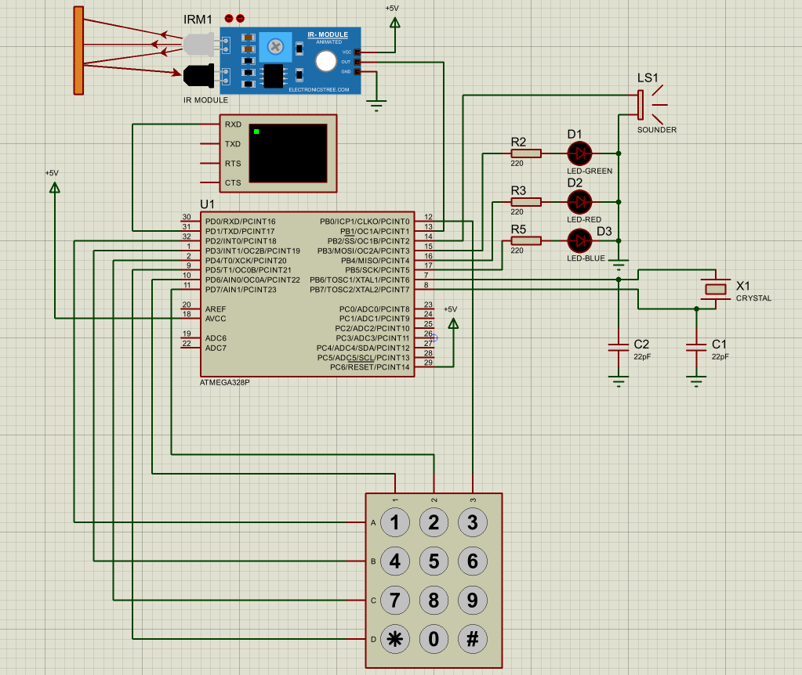

# lock-control-system

Система управления кодовым замком на базе микроконтроллера ATmega328P (Arduino Uno).

## Назначение

Устройство предназначено для ограничения и контроля доступа в служебное помещение.

## Функциональные возможности

Кодовый замок выполняет следующие действия:

- Обеспечивает доступ в помещение только после набора с помощью клавиатуры секретной четырёхзначной кодовой комбинации.
- Предоставляет пользователю ограниченное количество попыток набора секретной кодовой комбинации — не более трёх.
- Обеспечивает звуковую и визуальную сигнализацию несанкционированного доступа при превышении числа попыток или попытке взлома.
- Обеспечивает оперативную смену кодовой комбинации через меню администратора с подтверждением.
- Обеспечивает подсветку клавиатуры при приближении человека к двери с помощью датчика присутствия.

## Технические характеристики

- Микроконтроллер: ATmega328P (аппаратная платформа Arduino Uno).
- Тактовая частота: 16 МГц (внешний кварцевый резонатор).
- Клавиатура: матричная 4×3 или 4×4.
- Датчик приближения: инфракрасный датчик движения HC-SR501.
- Звуковая сигнализация: пьезоизлучатель.
- Визуальная сигнализация: трёхцветный светодиод (RGB) или отдельные светодиоды.
- Хранение кодовой комбинации: энергонезависимая память EEPROM.
- Питание: внешний источник 5 В.
- Программная реализация: язык C/C++.

## Структура репозитория

- `Arduino IDE/` — исходный код прошивки для микроконтроллера.
- `Proteus/` — файлы моделирования и электрической схемы устройства.
- `library/` — библиотека ИК датчика.

## Схема устройства

